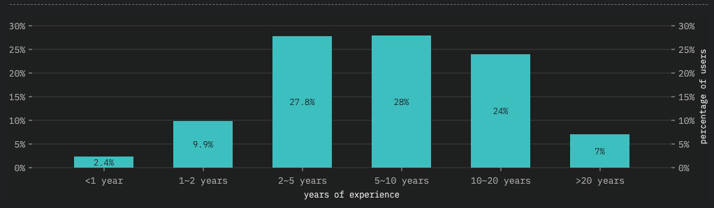

autoscale: true

# Estado de JS

---

# Índice

- Introducción
- Demografía
- "Sabores"
- Frameworks
- Gestión de Datos / Estado
- Backend
- Testing
- Móvil y Escritorio
- Otras Herramientas
- Conclusiones

---

# Introducción

- JavaScript es un lenguaje muy cambiante: nuevos frameworks, librerías e incluso implementaciones / evoluciones del propio lenguaje
- _Javascript Fatigue_
- [State of JS](https://stateofjs.com/)

---

# Demografía

---

## Salarios

---

## Experiencia

---

## Tamaño Empresa

---

## Género

---

# Sabores

---

## ES6

---

## Typescript

- Microsoft
- Superconjunto
- Tipado
- Funcionalidades nuevas

---

## Otros

---

### Flow

- ⚠️ Librería tipado **sólo**
- **No** superconjunto
- Facebook

---

### Reason

- Lenguaje tipado
- **No** superconjunto
- Compila a Javascript
- Sintaxis parecida pero NO igual
- Denotaciones de la Programación funcional

---

### Elm

- Lenguaje tipado
- Lenguaje funcional
- Compila a Javascript
- Hace especial hincapié en la simplicidad, facilidad de uso y calidad

---

### ClojureScript

- Compilador de Clojure a Javascript
- Dialecto de Lisp
- Lenguaje funcional
- Google Closure

---

### Datos generales

---

## Cuadrante

---

# Frameworks

---

## React

- Facebook
- Virtual DOM
- JSX
- Librería vs Componente
- Componente = Clase o Funciones

---

## Vue

- Evan You
- Rendimiento
- Reactividad

---

## Angular

- Google
- Inyección de dependencias
- Templates

---

## Otros

---

### Preact

- Alternativa a React
- Misma API
- Rendimiento y ligero

---

### Ember

- Doble binding
- Propiedades computadas
- Templating
- Inyección de dependencias

---

### Polymer

- Google
- Web Components

---

### Datos generales

---

## Cuadrante

^ - React y Vue
^ - Vue crecimiento
^ - Caída de Angular

---

# Gestión de Datos / Estado

---

## Redux

- Librería
- Arquitectura Flux
- Contenedor de estado predecible
- Middleware
- Filosofía Funcional

---

## GraphQL

- Facebook
- Lenguaje de Query
- Reemplazo a REST

---

## Otros

---

### Apollo

- Cliente GraphQL
- Facilidad de uso y flexibilidad
- Necesita optimizaciones en el caché de grandes aplicaciones

---

### Mobx

- Programación reactiva
- Librería
- Gestión del estado en React "a lo" Angular

---

### Relay

- Facebook
- Cliente GrapQL
- Sofisticado y eficiente pero complejo

---

### Datos generales

---

## Cuadrante

^ - Redux
^ - GraphQL: del 5% al 20% en 2 años
^ - Apollo como cliente GraphQL

---

# Backend

---

## Express

- MVC Framework
- Minimalista
- Rendimiento
- Flexible: routing, templates, etc

---

## Next.js

- Framework React
- Extensible
- Renderizado en servidor (SSR)

---

## Otros

---

### Koa

- Minimalista
- Rendimiento
- Modular

---

### Meteor

- Full Stack Framework
- Plataforma
- Integración con React, Angular, Vue, etc
- "Opinionated"

---

### Sails

- Framework
- Generador CRUDs, Endpoint, ...
- Estructura concreta

---

### Datos generales

---

## Cuadrante

^ - Express
^ - SSR: Next y Nuxt
^ - Serverless

---

# Testing

---

## Jest

- Testing Framework
- Simplicidad
- Snapshots
- Rendimiento (isolación + multiproceso)
- Runner + Aserciones
- Facebook
- Jasmine

---

## Mocha

- Necesita ser ampliado (mocks y aserciones)
- Configuración
- Flexible

---

## Jasmine

- Angular Oficial
- Parecido a Jest
  - Menos funcionalidad
  - Más documentación / artículos

---

## Otros

---

### Enzyme

- Testing componentes React
- DOM

---

### Karma

- Testing runner
- Webdriver
- Lento

---

### Ava

- Minimalista
- Paralelo
- Rendimiento

---

### Datos generales

---

## Cuadrante

^ - Muy fragmentado
^ - Satisfacción Jest

---

# Móvil y Escritorio

---

## Electron

- Github (Microsoft ??)
- Aplicaciones multiplataforma de escritorio
- Chromium: tecnologías web
- Agnóstico de framework

---

## React Native

- Facebook
- Aplicaciones nativas iOS y Android
- Tecnologías web
- React
- SDKs y APIs acceso hardware dispositivo
- Compila a código nativo ampliable

---

## Otros

---

### Cordova

- Acceso a funciones nativas del dispositivo
- Aplicaciones híbridas móviles
- Tecnologías Web

---

### Ionic

- Aplicaciones híbridas móviles
- Tecnologías Web
- Acceso Hardware dispositivo mediante Cordova
- PWA
- Generador

---

### Native Script

- Progress
- Angular / Vue
- Aplicaciones nativas iOS y Android
- SDKs y APIs acceso hardware dispositivo

---

### Datos generales

---

## Cuadrante

---

## Otras herramientas

---

## Lenguajes

---

## Herramientas de construcción

---

## Librerías de Utilidad

---

## IDE

---

## Premios

- Mayor Satisfacción -> Jest
- Mayor Interés -> GraphQL
- Más Usado -> React

---

# Conclusiones

- Ecosistema vivo y cambiante.
- Se aprecia estabilización. Fatiga JS.
- Multiuso: Videojuegos, Machine Learning, Realidad Virtual/Aumentada, Animaciones, [WebGL](https://threejs.org/), etc
- Backend / Serverless. GraphQl.
- [Arte](https://codepen.io/cobra_winfrey/pen/OYRBRG).
- Open Source

---

